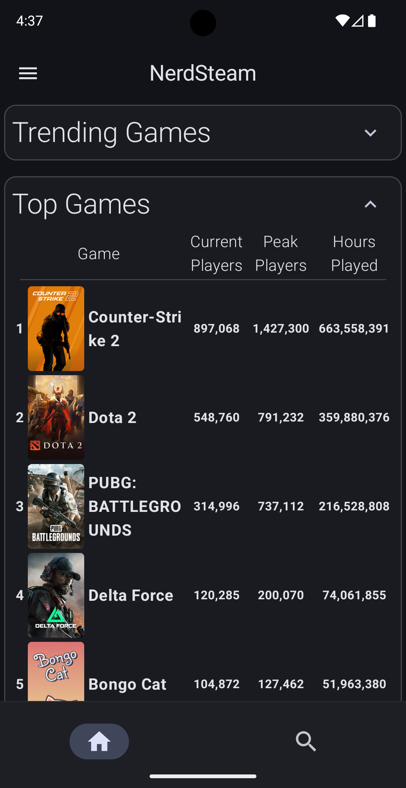
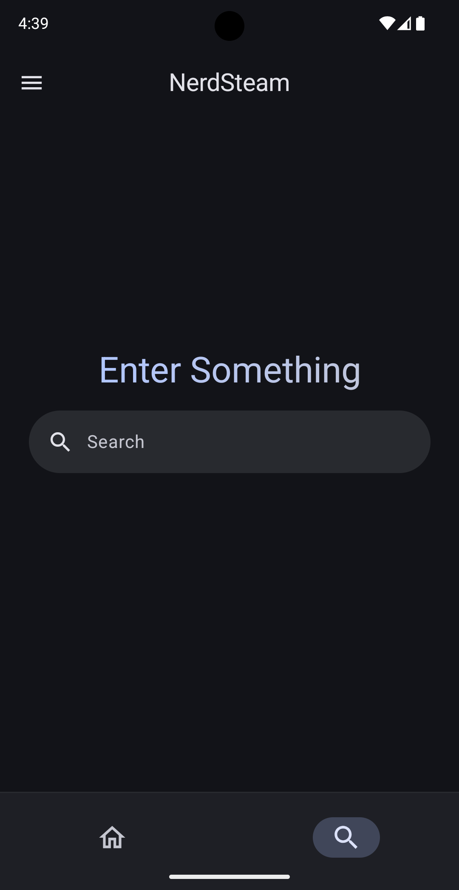
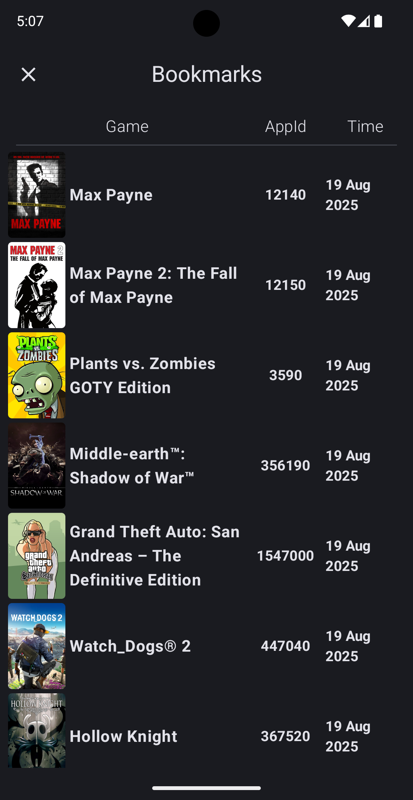
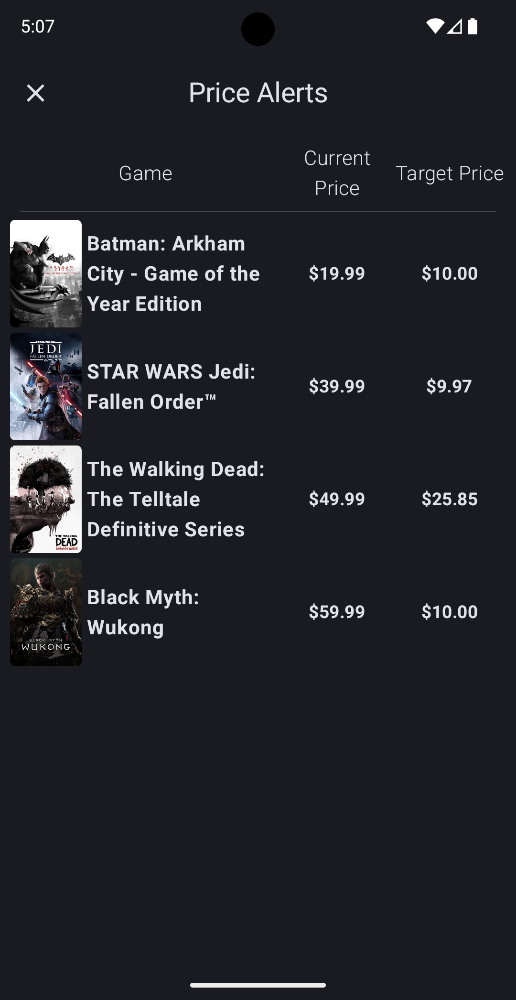
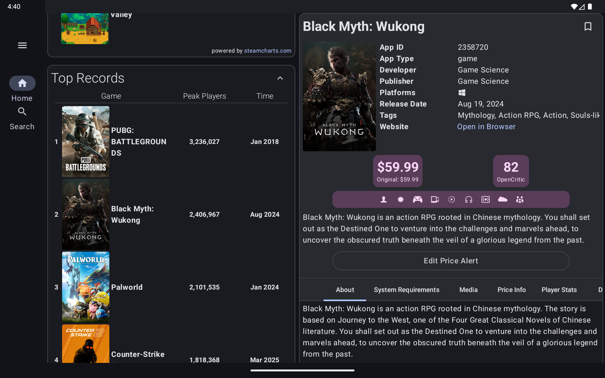
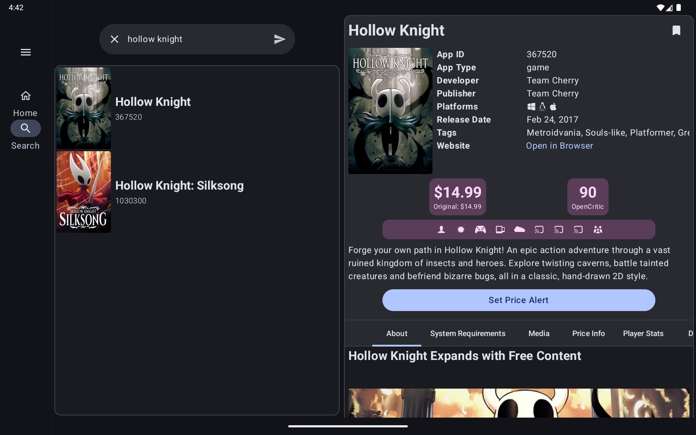
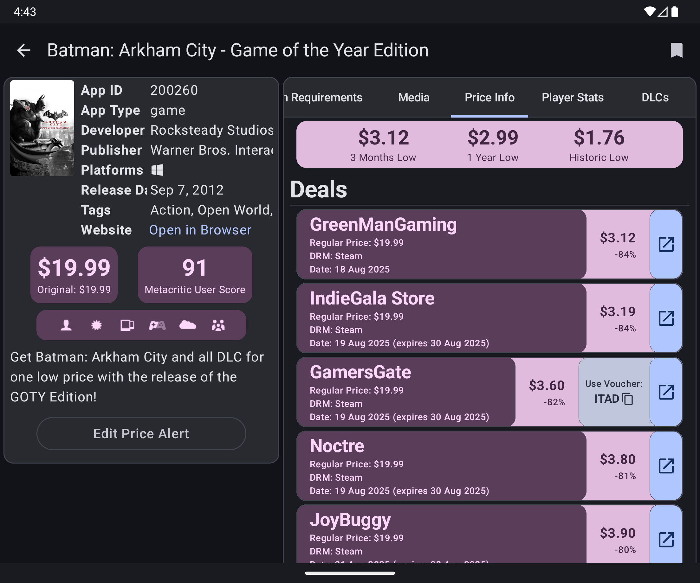
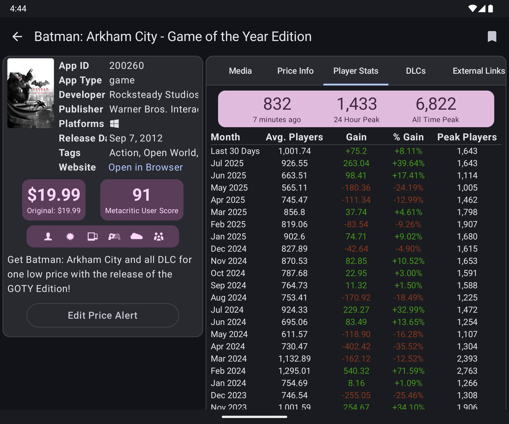

# NerdSteam

**NerdSteam** is a hobby project of mine where users can view trending and top games of [Steam](https://store.steampowered.com/),
compare prices across platforms, view historical pricing, track player statistics, and more.
The app is built using Kotlin + Jetpack Compose following MVVM architecture with a clean and responsive UI.

> [!Note]
> The project is not affiliated to Steam, SteamCharts, IsThereAnyDeal, or any other services that are used. It's merely a wrapper of all of the mentioned websites and is not meant to replace them.

<div align="center">
    <a href="https://github.com/khanshoaib3/nerd-steam/releases/latest"></a>
</div>

## Features

- View currently **trending games**, **top games** (based on the player count) and also **top records** (all time most played game by player count).
- View the game details in a structured and responsive UI.
- See **player statistics** i.e., how many players on average played the game at a specific month.
- **Compare prices** and deals for a game from other platforms (like GOG, Humble Store).
- Set **price alerts** and **bookmark** games for quick access.
- Data is sourced from multiple sources such as Steam, SteamCharts, and IsThereAnyDeal, while also caching data locally for performance.

<details><summary>View/Hide Screenshots</summary><p>
<table>
    <tbody>
        <tr>
            <td style="width:25%;">
                
            </td>
            <td style="width:25%;">
                
            </td>
            <td style="width:25%;">
                
            </td>
            <td style="width:25%;">
                
            </td>
        </tr>
        <tr>
            <td colspan="4">
                <div align="center">
                    
                    <span>Home Screen in a tablet</span>
                </div>
            </td>
        </tr>
        <tr>
            <td colspan="4">
                <div align="center">
                    
                    <span>Search Screen in a tablet</span>
                </div>
            </td>
        </tr>
        <tr>
            <td colspan="4">
                <div align="center">
                    
                    <span>Price Comparision of Batman: Arkham City GOTY Edition</span>
                </div>
            </td>
        </tr>
        <tr>
            <td colspan="4">
                <div align="center">
                    
                    <span>Player Statistics of Batman: Arkham City GOTY Edition</span>
                </div>
            </td>
        </tr>
    </tbody>
</table>
</details>

## Some Techinal Details

- The upcoming [Navigation 3](https://developer.android.com/guide/navigation/navigation-3) library is used primarily because it supports having multiple screens in one (look at the [two pane scene strategy](https://github.com/khanshoaib3/nerd-steam/blob/main/app/src/main/java/com/github/khanshoaib3/nerdsteam/ui/components/TwoPaneSceneStrategy.kt)).
- [Retrofit](https://square.github.io/retrofit/) is used for using the APIs and [Jsoup](https://jsoup.org/) for scraping.
- The data from Steam Charts is locally cached on an hourly basis.
- Similarly, the game details (excluding player statistics) are also cached on a per day basis, by saving them in a cache file ([look here](https://github.com/khanshoaib3/nerd-steam/blob/main/app/src/main/java/com/github/khanshoaib3/nerdsteam/data/local/CacheRepository.kt)).
- Dependency injection is managed with [hilt](https://developer.android.com/training/dependency-injection/hilt-android).

## Project Setup

Add your IsThereAnyDeal API key to `secret.properties` which should be located in the project's root folder:

```
IS_THERE_ANY_DEAL_API_KEY="<your_api_key_here>"
```

That's it! After this you'll be able to build using the latest Android Studio version.

## Credits & Resources

- **[Steam](https://store.steampowered.com/)**
- **[SteamCharts](https://steamcharts.com/)** - for player statistics.
- **[IsThereAnyDeal](https://isthereanydeal.com/)** - for price deals and historical statistics.
- **[SteamDB](https://steamdb.info/)** - for inspiration, originally I planned to make a mobile version of this but quickly realised I can't as its database is private. (I also use the [steam category icons](https://github.com/khanshoaib3/nerd-steam/blob/65e4b3e190d551a927fbdb0fd171aed735b5050a/app/src/main/java/com/github/khanshoaib3/nerdsteam/data/model/appdetail/CommonAppDetails.kt#L107) from steamdb XD.)
- **[Philipp Lackner](https://www.youtube.com/@PhilippLackner)** - for his amazing videos on kotlin and android.
- **[Google's Developer Courses](https://developer.android.com/courses/android-basics-compose/course)**
- **[Recipes Repository](https://github.com/android/nav3-recipes)** - for examples.

## Similar Apps

- **[Observatory](https://getobservatory.app/)** - has price tracking and filtering, better for finding deals.
